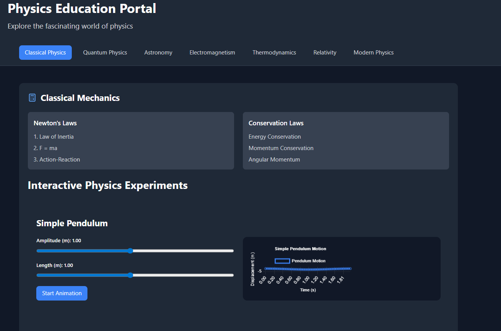
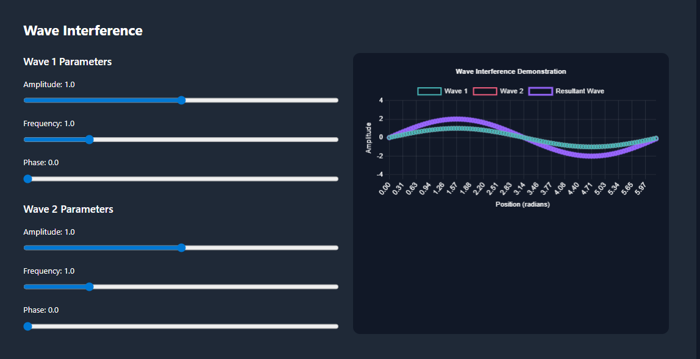
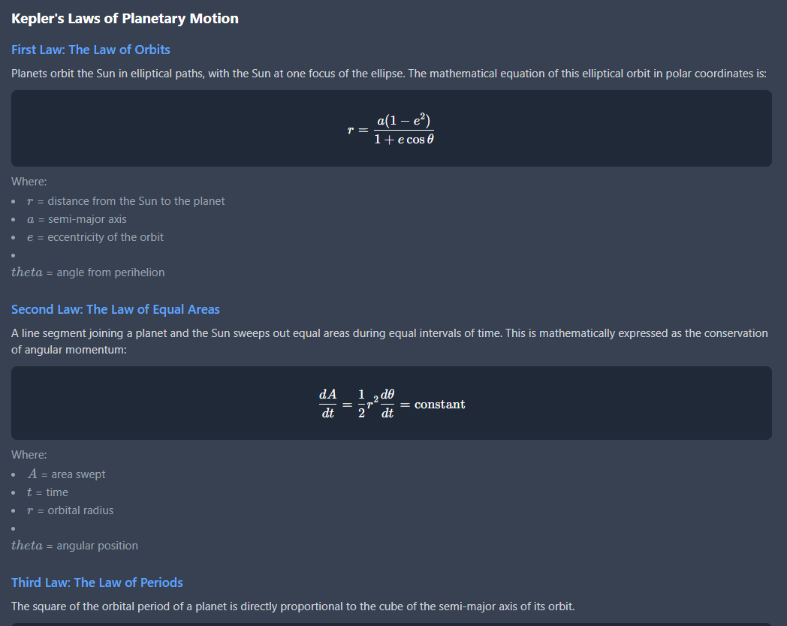
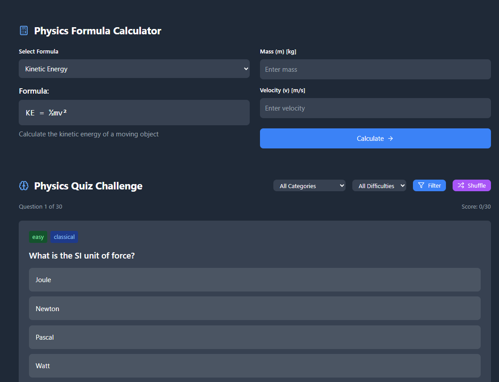
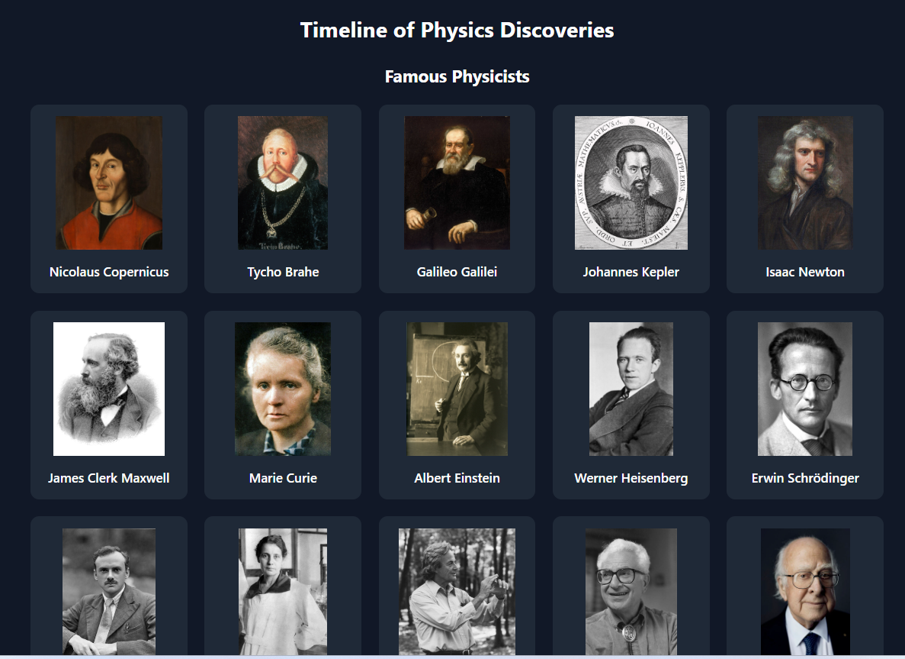

[View Live Demo](https://aliminagar.github.io/physics-education-portal/)

# Physics Education Portal

An interactive, comprehensive physics education platform built with React, TypeScript, and modern web technologies. This portal provides students, educators, and physics enthusiasts with engaging visualizations, simulations, and educational content covering all major areas of physics.

## Prototype / Instructional Showcase
This project is an instructional prototype and portfolio showcase demonstrating immersive, simulation-driven learning experiences in a web-based environment. Certain sections are included to illustrate planned capabilities and may not be fully implemented in the current build.

## 🌟 Features

### Interactive Physics Simulations

- **3D Visualizations**: Interactive atomic models, molecular structures, and quantum mechanics demonstrations
- **Wave Physics**: Real-time wave interference patterns and oscillation simulations
- **Orbital Mechanics**: Solar system simulator with realistic planetary motion
- **Electromagnetic Fields**: Visual representations of electric and magnetic field interactions
- **Quantum Mechanics**: Particle-in-a-box simulations and wave function visualizations

### Educational Content

- **Comprehensive Timeline**: Evolution of atomic theory from Ancient Greece to modern quantum mechanics
- **Physics Calculator**: Built-in calculator for common physics formulas and equations
- **Interactive Quizzes**: Adaptive quizzes covering all physics topics with detailed explanations
- **Study Resources**: Curated learning materials organized by difficulty level
- **Problem Solving**: Step-by-step solutions to advanced physics problems

### Advanced Features

- **Real-time Simulations**: Matter.js and Three.js powered physics engines
- **Mathematical Rendering**: LaTeX equation support with KaTeX
- **Responsive Design**: Optimized for desktop, tablet, and mobile devices
- **Dark Theme**: Modern, eye-friendly interface design
- **Progress Tracking**: Personal learning path and achievement system
- 
## Accessibility & Inclusive Design (WCAG-Aligned)
This platform applies accessibility-first UI design principles aligned with WCAG 2.1 Level AA goals, including:

Semantic structure and predictable navigation

Keyboard-friendly interactions for core UI flows

Responsive layout for desktop/tablet/mobile

High-contrast dark theme considerations
Planned verification: axe DevTools/WAVE checks and screen reader testing (NVDA/VoiceOver).

## 🚀 Live Demo

[View Live Demo](https://aliminagar.github.io/physics-education-portal/)

## 📱 Screenshots

### Main Dashboard – Classical Physics


_Legend: The main dashboard view, featuring navigation across all major physics topics, classical mechanics theory highlights, and an interactive simple pendulum simulation._

---

### Wave Interference Simulation


_Legend: Interactive wave interference simulation—adjust amplitude, frequency, and phase for two waves, and visualize the resultant wave in real time._

---

### Kepler's Laws of Planetary Motion


_Legend: Detailed display of Kepler’s three laws of planetary motion, with equations and explanatory text for each law—showcasing the educational and scientific rigor of the portal._

---

### Formula Calculator and Quiz Challenge


_Legend: Physics formula calculator for quick computations (e.g., kinetic energy) and an interactive quiz challenge to test physics knowledge across multiple topics and difficulty levels._

---

### Timeline of Physics Discoveries


_Legend: Explore the timeline of physics discoveries through portraits of influential physicists, spanning from Copernicus to Higgs—illustrating the human story behind the science._

## 🛠️ Technology Stack

### Frontend

- **React 18** - Modern React with hooks and concurrent features
- **TypeScript** - Type-safe development
- **Vite** - Fast build tool and development server
- **Tailwind CSS** - Utility-first CSS framework

### 3D Graphics & Animations

- **Three.js** - 3D graphics library
- **React Three Fiber** - React renderer for Three.js
- **React Three Drei** - Useful helpers for React Three Fiber
- **Matter.js** - 2D physics engine for realistic simulations

### Mathematical & Scientific

- **KaTeX** - Fast math typesetting
- **React KaTeX** - React components for mathematical expressions
- **Chart.js** - Interactive charts and graphs
- **React Chart.js 2** - React wrapper for Chart.js

### UI/UX

- **Lucide React** - Beautiful, customizable icons
- **React Markdown** - Markdown rendering support
- **Zustand** - Lightweight state management

## 📋 Prerequisites

Before running this project, make sure you have the following installed:

- **Node.js** (version 18.0 or higher)
- **npm** (version 8.0 or higher) or **yarn** (version 1.22 or higher)
- **Git** (for cloning the repository)

## 🔧 Installation

### 1. Clone the Repository

```bash
git clone https://github.com/YOUR_USERNAME/physics-education-portal.git
cd physics-education-portal
```

### 2. Install Dependencies

Using npm:

```bash
npm install
```

Using yarn:

```bash
yarn install
```

### 3. Start Development Server

Using npm:

```bash
npm run dev
```

Using yarn:

```bash
yarn dev
```

### 4. Open in Browser

Navigate to `http://localhost:5173` in your web browser.

## 🏗️ Build for Production

### Create Production Build

Using npm:

```bash
npm run build
```

Using yarn:

```bash
yarn build
```

### Preview Production Build

Using npm:

```bash
npm run preview
```

Using yarn:

```bash
yarn preview
```

## 📁 Project Structure

```
physics-education-portal/
├── public/                     # Static assets
│   ├── vite.svg               # Vite logo
│   └── favicon.ico            # Website favicon
├── src/                       # Source code
│   ├── components/            # React components
│   │   ├── AtomicModelsTimeline.tsx    # Atomic theory evolution
│   │   ├── CommunityForum.tsx          # Discussion forum
│   │   ├── CurrentTypes.tsx            # DC vs AC current
│   │   ├── EinsteinEquation.tsx        # E=mc² visualization
│   │   ├── InteractiveExperiments.tsx  # Physics experiments
│   │   ├── KeplerLaws.tsx             # Planetary motion laws
│   │   ├── LightPhysics.tsx           # Light wave-particle duality
│   │   ├── MoleculeViewer.tsx         # 3D molecular structures
│   │   ├── NewsSection.tsx            # Physics news and updates
│   │   ├── NuclearPhysics.tsx         # Nuclear reactions
│   │   ├── OpticsAndLenses.tsx        # Optics simulations
│   │   ├── OrbitalMechanics.tsx       # Orbital simulations
│   │   ├── PersonalizedLearning.tsx   # Learning paths
│   │   ├── PhysicsCalculator.tsx      # Formula calculator
│   │   ├── PhysicsProblems.tsx        # Problem solving
│   │   ├── PhysicsQuiz.tsx            # Interactive quizzes
│   │   ├── PhysicsTimeline.tsx        # History of physics
│   │   ├── QuantumMechanics.tsx       # Quantum simulations
│   │   ├── SolarSystemSimulator.tsx   # Solar system model
│   │   ├── StudyResources.tsx         # Learning materials
│   │   ├── ThreeDViewer.tsx           # 3D model viewer
│   │   └── WaveInterference.tsx       # Wave physics
│   ├── App.tsx                # Main application component
│   ├── main.tsx              # Application entry point
│   ├── index.css             # Global styles
│   └── vite-env.d.ts         # Vite type definitions
├── package.json              # Project dependencies and scripts
├── tsconfig.json            # TypeScript configuration
├── tailwind.config.js       # Tailwind CSS configuration
├── vite.config.ts          # Vite configuration
├── LICENSE                 # MIT License with attribution
└── README.md              # Project documentation
```

## 🎯 Usage Guide

### Navigation

- Use the top navigation tabs to switch between different physics topics
- Each section contains interactive simulations and educational content
- Scroll down to explore the physics timeline and historical discoveries

### Interactive Features

- **3D Models**: Click and drag to rotate, scroll to zoom, right-click to pan
- **Simulations**: Adjust parameters using sliders and controls
- **Quizzes**: Select answers and view detailed explanations
- **Calculator**: Choose formulas and input values for calculations

### Educational Content

- **Timeline**: Explore the history of physics discoveries
- **Atomic Models**: Navigate through different atomic theories
- **Simulations**: Experiment with various physics phenomena
- **Problems**: Work through step-by-step physics problems

## 🧪 Available Simulations

### Classical Mechanics

- Simple pendulum motion
- Projectile motion calculator
- Newton's laws demonstrations
- Conservation of energy and momentum

### Quantum Mechanics

- Particle in a box visualization
- Wave function probability distributions
- Quantum tunneling effects
- Atomic orbital models

### Electromagnetism

- Electric and magnetic field visualizations
- DC vs AC current comparisons
- Electromagnetic wave propagation
- Maxwell's equations demonstrations

### Thermodynamics

- Heat transfer simulations
- Thermodynamic cycles
- Entropy and energy distributions
- Phase transitions

### Modern Physics

- Special and general relativity effects
- Nuclear decay simulations
- Particle physics interactions
- Cosmological models

## 🎨 Customization

### Themes

The application uses a dark theme by default. To customize colors, modify the Tailwind configuration in `tailwind.config.js`.

### Adding New Simulations

1. Create a new component in the `src/components/` directory
2. Import and add it to the appropriate section in `App.tsx`
3. Follow the existing component structure for consistency

### Mathematical Expressions

Use KaTeX for rendering mathematical expressions:

```tsx
import { InlineMath, BlockMath } from 'react-katex';

// Inline math
<InlineMath>E = mc^2</InlineMath>

// Block math
<BlockMath>
  \frac{\partial^2 \psi}{\partial t^2} = \frac{\hbar^2}{2m} \nabla^2 \psi + V\psi
</BlockMath>
```

## 🤝 Contributing

We welcome contributions from the physics and developer communities! Here's how you can help:

### Types of Contributions

- **Bug Reports**: Found a bug? Please open an issue
- **Feature Requests**: Have an idea? We'd love to hear it
- **Code Contributions**: Submit pull requests for improvements
- **Educational Content**: Help improve explanations and add new topics
- **Documentation**: Help improve this README and code documentation

### Development Workflow

1. Fork the repository
2. Create a feature branch (`git checkout -b feature/amazing-feature`)
3. Make your changes
4. Add tests if applicable
5. Commit your changes (`git commit -m 'Add amazing feature'`)
6. Push to the branch (`git push origin feature/amazing-feature`)
7. Open a Pull Request

### Code Style

- Use TypeScript for all new components
- Follow the existing component structure
- Use Tailwind CSS for styling
- Add proper type definitions
- Include JSDoc comments for complex functions

### Testing

- Test your changes across different browsers
- Ensure responsive design works on mobile devices
- Verify mathematical expressions render correctly
- Test 3D interactions and simulations

## 📚 Educational Standards

This platform aligns with various educational standards:

- **AP Physics**: Covers all AP Physics 1, 2, and C topics
- **IB Physics**: Comprehensive coverage of IB Physics curriculum
- **University Level**: Suitable for undergraduate physics courses
- **Self-Learning**: Perfect for independent study and exploration

## 🔧 Troubleshooting

### Common Issues

**Issue**: 3D models not loading
**Solution**: Ensure WebGL is enabled in your browser

**Issue**: Mathematical expressions not rendering
**Solution**: Check that KaTeX CSS is properly loaded

**Issue**: Simulations running slowly
**Solution**: Close other browser tabs and ensure hardware acceleration is enabled

**Issue**: Mobile responsiveness issues
**Solution**: Clear browser cache and ensure you're using a modern mobile browser

### Performance Optimization

- The app uses code splitting for optimal loading
- 3D simulations are optimized for 60fps performance
- Mathematical rendering is cached for better performance

## 📄 License

This project is licensed under the MIT License with Attribution Requirement - see the [LICENSE](LICENSE) file for details.

### Attribution Requirement

If you use any part of this code or its derivatives, you must provide appropriate credit to the original author, Alireza Minagar, by including the following notice in your project:

"This project includes code developed by Alireza Minagar (2025)."

## 👨‍💻 Author

**Alireza Minagar**

- GitHub: [aliminagar/physics-education-portal](https://github.com/aliminagar/physics-education-portal)
- Email: aminagar@gmail.com
- LinkedIn: [alireza-minagar-md-mba-ms-biotech-bioinformatics-b450aa173](https://www.linkedin.com/in/alireza-minagar-md-mba-ms-biotech-bioinformatics-b450aa173)

## 🙏 Acknowledgments

- **Three.js Community** - For the amazing 3D graphics library
- **React Team** - For the excellent React framework
- **Physics Educators** - For inspiration and educational guidance
- **Open Source Community** - For the tools and libraries that made this possible

## 📈 Roadmap

### Upcoming Features

- [ ] Virtual Reality (VR) support for immersive physics experiences
- [ ] Augmented Reality (AR) for real-world physics demonstrations
- [ ] Collaborative learning features and study groups
- [ ] Advanced AI-powered tutoring system
- [ ] Mobile app versions for iOS and Android
- [ ] Integration with Learning Management Systems (LMS)
- [ ] Multi-language support for global accessibility
- [ ] Advanced analytics and learning insights

### Long-term Goals

- [ ] Partnership with educational institutions
- [ ] Certification and assessment programs
- [ ] Teacher dashboard and classroom management tools
- [ ] Advanced simulation builder for educators
- [ ] Integration with physics laboratory equipment
- [ ] Real-time collaborative experiments

## 📞 Support

If you encounter any issues or have questions:

1. **Check the Documentation**: Review this README and inline code comments
2. **Search Issues**: Look through existing GitHub issues
3. **Create an Issue**: If you can't find a solution, create a new issue
4. **Community Forum**: Join discussions in the community forum section
5. **Email Support**: Contact the maintainer directly for urgent issues

## 🌟 Star History

If you find this project helpful, please consider giving it a star on GitHub! ⭐

---

**Made with ❤️ for physics education and open source learning**

_Last updated: March 2025_
